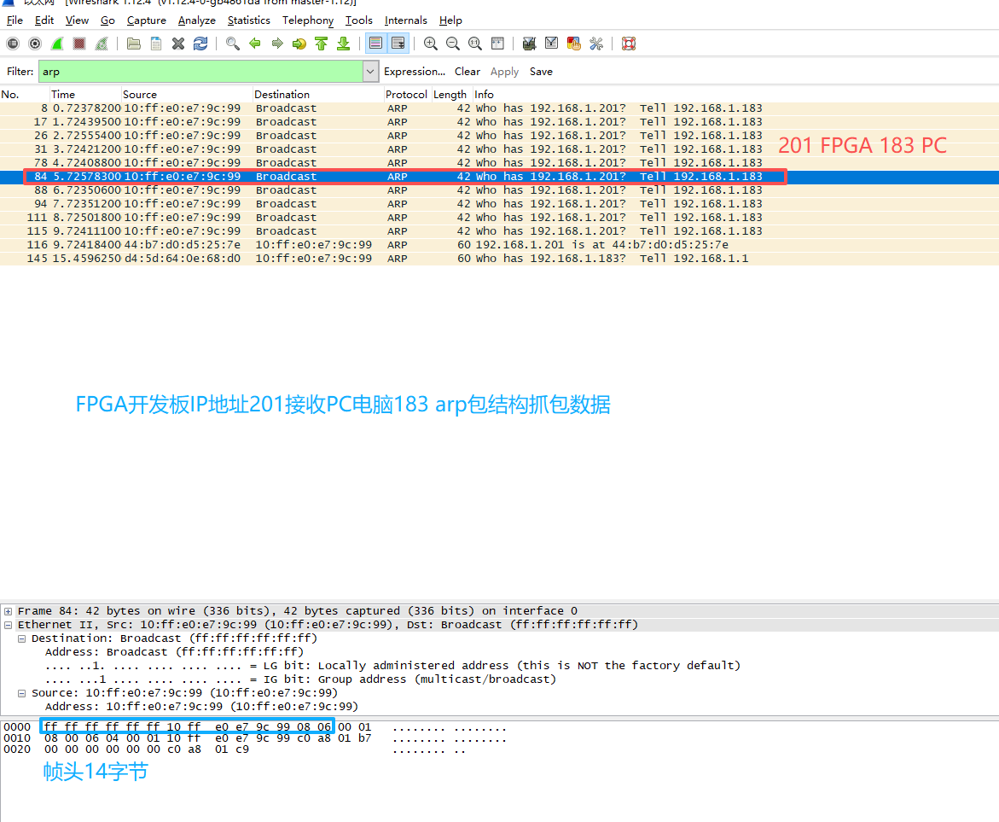
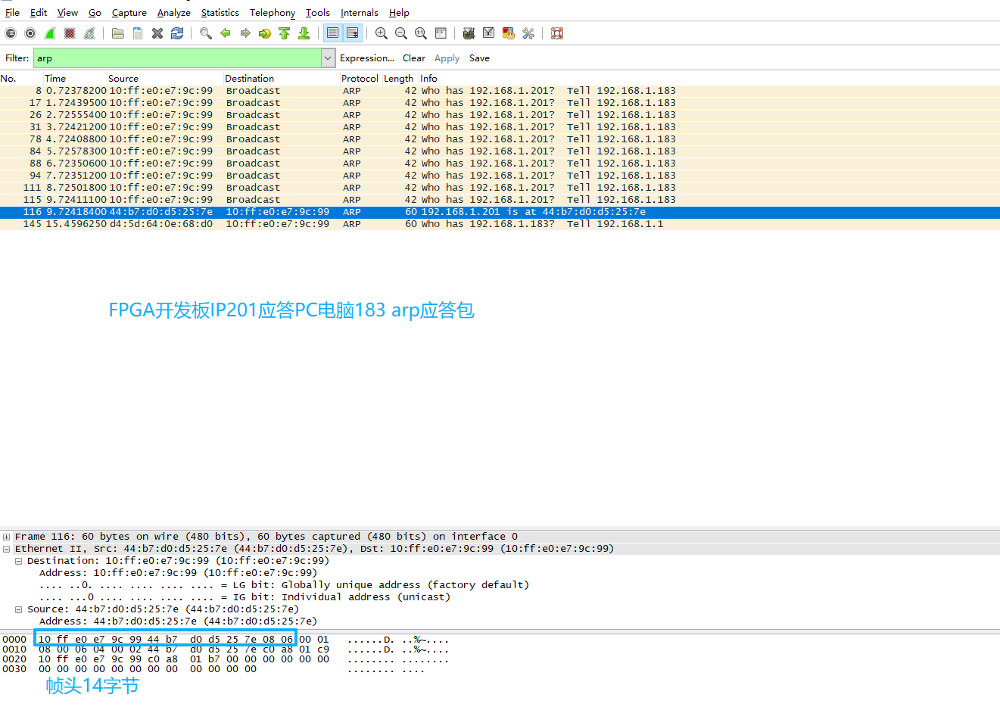
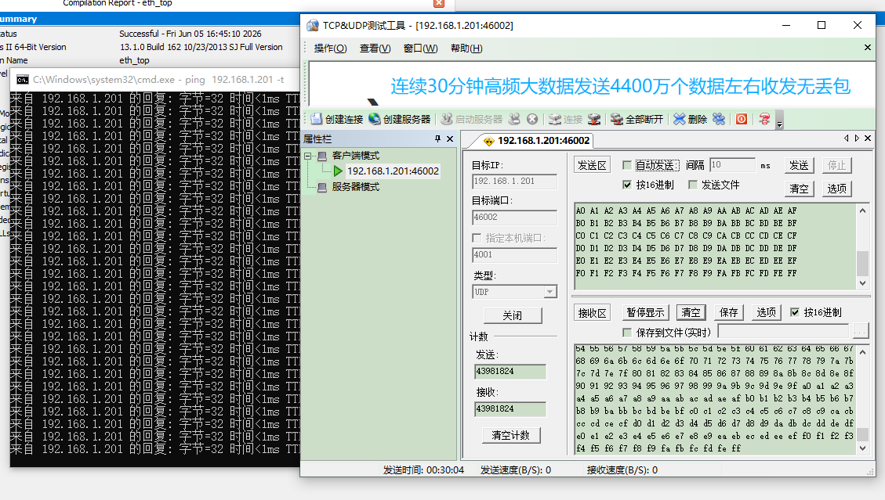
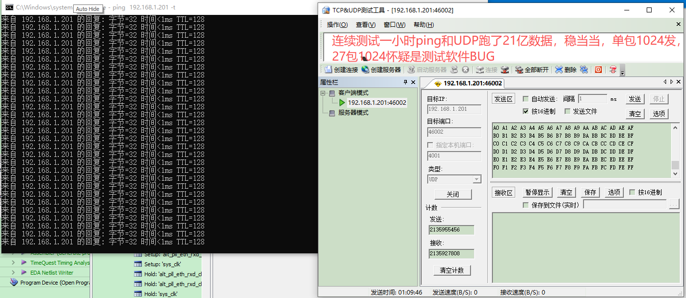

# fpga_ethernet_stack

精简千兆以太网协议栈，支持 ARP/ICMP/UDP，纯 Verilog 实现。

## 功能
- ARP 应答
- ICMP Ping 响应
- UDP 收发

## 使用方法
架构搭建：
协议栈顶层：
frame_rxd模块：
1.接收以太网帧，首先检测前导码正确把数据并行写入后端bram里面。
2.数据采用打5拍，解决CRC计算完成最后一个数据，把接收CRC 后4拍一次提前参与比较一样输出done告诉后端模块接收到一个完整的网络帧在BRAM里面。

ARP、ICMP、UDP接收模块：
1.收到frame_rxd_done，开始从BRAM 地址0读取数据，判断协议类型、MAC地址、IP地址、端口是否属于自己继续解析，否则退出解析。
2.ICMP、ARP、UDP解析完成后，把接收到的MAC地址、IP地址、端口输出给后端模块，ICMP需要缓存接收反馈数据包。
3.ARP、ICMP解析完成，输出done告诉后端发送，输出接收数据长度给后端发送封包用。

ARP、ICMP、UDP发送模块：
1.收到arp,icmp接收完成done，UDP发送由外部发送请求req, 根据各自协议格式开始封包写入bram给后端发送。
2.ICMP和UDP累加和计算是一个大头，我在这个位置卡了好久，把方案推翻5-6次，最终经过权衡采用提前计算，地址回填的方法，提高效率。
累加和推翻次数：
第一次一边封包一边计算最后地址回填导致后面延迟10几个周期。
第二次打算接收提前计算后半部分，发送计算前办部分，这样解决地址回填，后面发现ICMP接收和发送TTL和协议类型不一样修改修改此方案推翻。
第三次打算发送模块只负责分包，校验有后端模块统一校验，发现此方案复杂，后端需要知道是什么类型的包，从那个位置开始计算，不精简推翻。
........省略。
最终在简洁和高效中进行博弈好久，最终采用了，封包数据和校验独立，互不影响，校验在前封包数据在后，校验完成直接回填数据。
校验在前不需要封包完成等待校验完成后，在回填提高了效率。同时发送done也是提前输出，真正实现零气泡。
校验奇数和偶数问题，读取BRAM使能精准控制，使能有效使用bram数据，否则填充00对校验没有影响完美的解决方法。

主状态机仲裁：
1.收到ARP、ICMP、UDP发送请求，根据优先级，输出done到后端frame_txd发送模块。

frame_txd模块：
1.收到主状态机仲裁结果，根据发送数据长度读取对应BRAM地址获取发送数据。
2.负责填充前导码和CRC校验，前端模块发送只负责协议封包。
3.发送前导码并提前读取BRAM数据，先进行CRC32计算，前导码发送完成接着输出BRAM数据，发送数据和CRC校验一气呵成。

## 系统架构图

## 接收波形图

## Wireshark 抓包验证

## UDP调试工具测试

## 避坑指南
避坑1：以太网接收时钟相位问题
采用PLL对ETH_RXD_CLK时钟做了180度相移才能正确采样。

避坑2：以太网发送时钟相位问题
采用PLL对ETH_GTX_CLK时钟做了0度相移做数据发送，RGMII输出是把ETH_GTX_CLK进入DDIO输出ETH_TXD_CLK。
DDIO输出TXC，利用DDIO固有延迟配合PHY内部TX delay，满足RGMII建立保持时间要求。

避坑3：CRC大小端问题
以太网帧发送模块CRC，一开始大小端搞错了数据发出Wireshark抓不到数据，后来我用回环测试，自发自收发现接收校验和发送校验大小端颠倒。

避坑4：mdio以太网寄存器配置
1.复位等待时间必须严格按照手册要求。否则会出现写寄存器失败。
2.必须实现寄存器读写功能，写完成读取出来核对是否一致。
3.我回环测试的时候设置寄存器错误，导致收不到数据，通过回读寄存器才发现寄存器配置错了。

避坑5：BRAM残留数据污染校验累加和。
发送模块封包读取要发送的BRAM，校验和会延迟一拍，导致BRAM多吐出一个字节，这个字节可能是随机的，
通过读取使能判断，有效输出BRAM数据否则00给后端校验，避免累加和错误。我在进行压力测试的时候一边Ping一边UDP发大量数据，
会出现ping超时，用Wireshark能抓到FPGA的ICMP返回包，最终通过signaltap排查原因是BRAM多吐出的一个字节不是00导致校验出错。

避坑6：累加和奇偶数处理
采用使能延迟一拍关闭，最后自动补充00，偶数多算一个00无影响，
奇数刚好补齐不需要区分奇偶，统一处理优雅解决。

避坑7：UDP接收偶尔不稳定。
通过设置约束，强制缩短物理路径。
set_instance_assignment -name FAST_INPUT_REGISTER ON -to eth_rxd[*]
set_instance_assignment -name FAST_INPUT_REGISTER ON -to eth_rx_ctl
通过多个项目验证目前极其稳定，FPGA网络摄像头，FPGA读取OV5640传输给PC电脑展示，PC电脑传输RGB888图片，FPGA网络接收写入SDRAM，
在读取SDRAM送到VGA显示。
