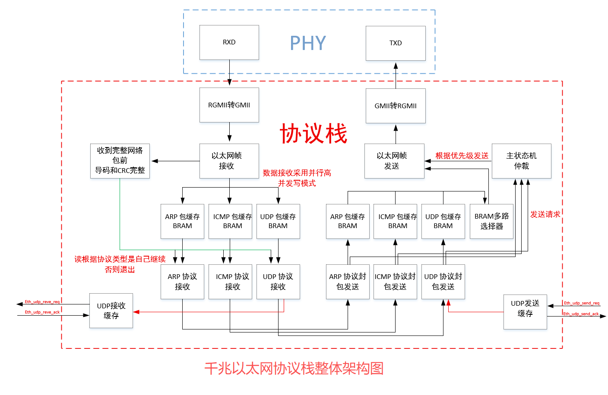
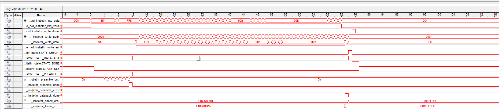
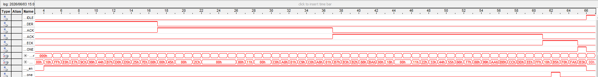

# fpga_ethernet_stack

精简千兆以太网协议栈，支持 ARP/ICMP/UDP，纯 Verilog 实现。

## 功能
- ARP 应答
- ICMP Ping 响应
- UDP 收发

## 使用方法
...
## 系统架构图

## 接收波形图

## Wireshark 抓包验证

## 避坑指南

- **时钟相位**：接收时钟需做 180° 相移，发送需配合 PHY 内部延迟。
- **CRC 大小端**：发送与接收模块的 CRC 位序相反，务必通过回环测试验证。
- **BRAM 残留数据**：读取 BRAM 时，无效周期必须填充 0x00，避免校验和污染。
- **MDIO 配置**：务必实现读写回读校验，寄存器配置错误会导致收不到数据。
- **累加和奇偶**：使能延迟一拍关闭，偶数多算一个 0x00 无影响，统一处理。
- 
